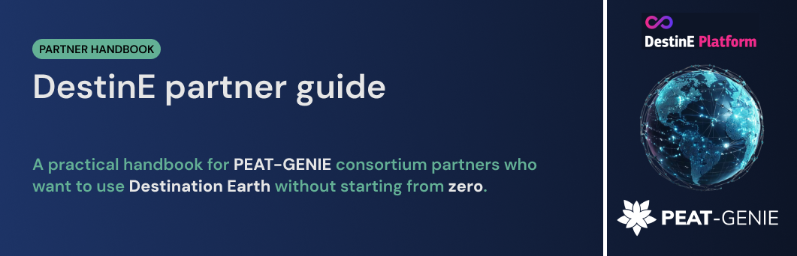

# DestinE partner guide

A short guide to finding data, understanding Destination Earth services, and trying small Python examples. It is intended for partners who are new to DestinE. The tutorials teach data access and inspection; they do not deliver validated scientific maps or models.

**[Start here](docs/start-here.md)** · **[Choose a service](docs/services/README.md)** · **[Set up access](docs/setup/README.md)** · **[Open tutorials](notebooks/README.md)**

## Understand the parts

- The **[DestinE Platform](docs/ecosystem/platform-map.md)** is an entry point to services.
- The **[DestinE Data Lake](docs/services/data-lake-hda.md)** helps users find and obtain datasets.
- The **[Digital Twins](docs/ecosystem/digital-twins.md)** provide simulated climate and weather information.
- **[Copernicus Data Space Ecosystem (CDSE)](docs/services/cdse-sentinel-hub.md)** is a separate route to Sentinel data with its own account and APIs.

The [ecosystem overview](docs/ecosystem/README.md) explains how these parts relate. Access permissions vary by service.

## Choose by task

| To do this | Start here |
| --- | --- |
| Find and retrieve datasets | [HDA](docs/services/data-lake-hda.md), [EDEN](docs/services/eden.md), or [SesamEO](docs/services/sesameo.md) |
| Inspect Sentinel imagery | [CDSE Browser and Sentinel Hub](docs/services/cdse-sentinel-hub.md) |
| Explore regional imagery | [NUPSI](docs/services/nupsi.md) |
| Work with climate and elevation arrays | [Earth Data Hub](docs/services/earth-data-hub.md) |
| Request Digital Twin subsets | [Polytope](docs/services/polytope.md) |
| Run code close to the data | [Insula](docs/services/insula.md) or [Data Lake computing](docs/services/near-data-computing.md) |

The [service directory](docs/services/README.md) covers the remaining services and distinguishes each access route.

## Try one small example

1. Follow the [setup instructions](docs/setup/README.md) to create the Python environment.
2. Select one of the [14 tutorials](notebooks/README.md) and read its input and access requirements.
3. Follow the [account instructions](docs/setup/accounts.md) for that service. CDSE, Earth Data Hub, and DestinE services use different credentials.

## Guide sections

| Section | Contents |
| --- | --- |
| [Start here](docs/start-here.md) | A short route for readers, researchers, and developers |
| [Services](docs/services/README.md) | What each service provides and how to access it |
| [Tutorials](notebooks/README.md) | Fourteen notebook examples and their prerequisites |
| [Setup](docs/setup/README.md) | Environment, accounts, and troubleshooting |
