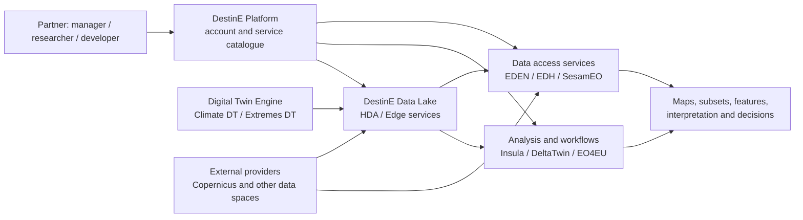

# Platform map

[Home](../../README.md) · [Ecosystem](README.md) · [Service guide](../services/README.md)

## The three core components

| Component | Responsibility | Practical question it answers |
| --- | --- | --- |
| **DestinE Platform**, implemented under ESA | Entry point, service ecosystem, applications and user access | Where do I sign in and choose a service? |
| **DestinE Data Lake**, implemented by EUMETSAT | Data discovery, access, federation, and processing close to data | How do I find, obtain, and process data efficiently? |
| **Digital Twin Engine and first Digital Twins**, implemented by ECMWF | Software infrastructure and Earth-system simulations | Which simulated climate or extreme-weather information can inform my analysis? |

These responsibilities are described in the [official DestinE overview](https://destination-earth.eu/destination-earth/).

Arrows illustrate learning and data-access routes; they do not prescribe internal service deployment or imply that every service exposes every dataset.

## Related platforms remain distinct

[Copernicus Data Space Ecosystem (CDSE)](../services/cdse-sentinel-hub.md) provides Copernicus Browser and a CDSE deployment of Sentinel Hub APIs. A CDSE request to `sh.dataspace.copernicus.eu` is a related external workflow. Registering for DestinE does not generate a CDSE OAuth client. [CDSE API documentation](https://documentation.dataspace.copernicus.eu/APIs/SentinelHub/Overview/Authentication.html)

ERA5 / ERA5-Land are reanalysis products; Climate DT products are simulations. Finding a Copernicus product in a DestinE service does not change its provider, licence, scientific meaning, or attribution requirements. Save the original collection metadata alongside your results.

## Three useful first routes

- **Understand and demonstrate:** [NUPSI](../services/nupsi.md), [EDEN](../services/eden.md), or [SesamEO](../services/sesameo.md).
- **Analyze a small subset in Python:** [EDH](../services/earth-data-hub.md), [HDA](../services/data-lake-hda.md), or [CDSE Sentinel Hub](../services/cdse-sentinel-hub.md).
- **Scale an established workflow:** [near-data computing](../services/near-data-computing.md), [Insula](../services/insula.md), or [DeltaTwin](../services/deltatwin.md).

Continue to [Digital Twins](digital-twins.md) or [accounts](../setup/accounts.md).

